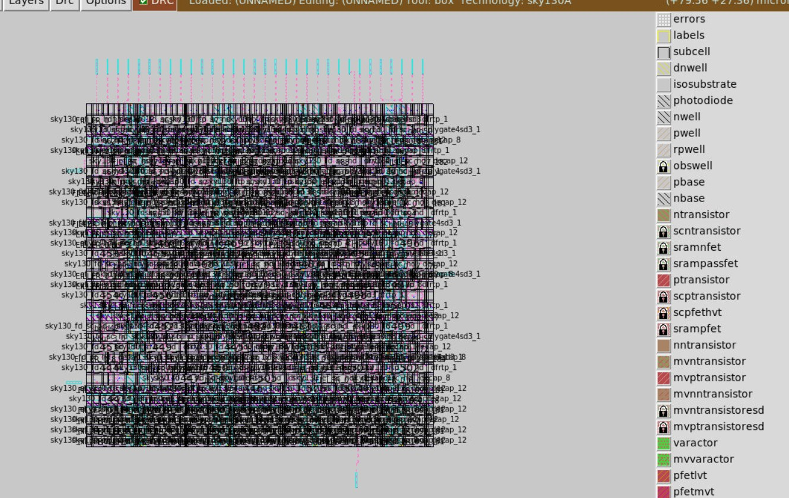
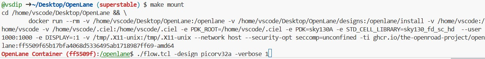
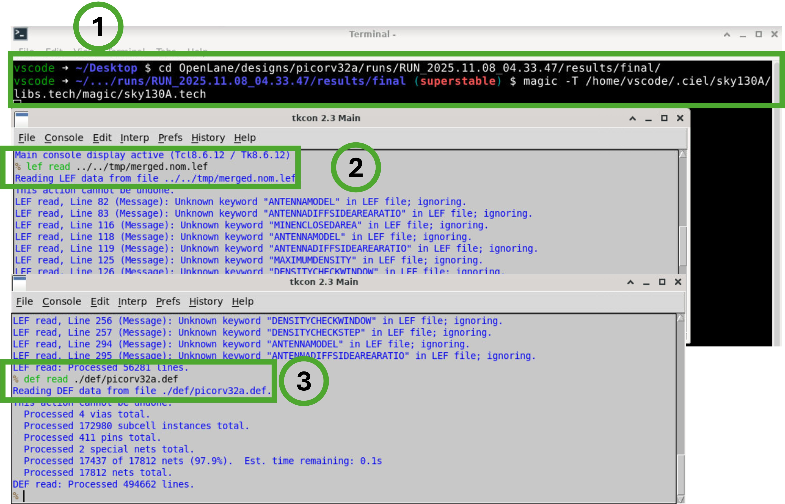
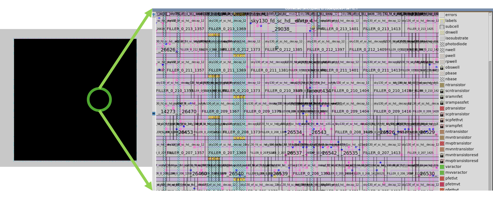

# VSD OpenLane Codespace

A ready-to-use **cloud workspace** to learn and run **Physical Design using OpenLane and Magic** — right inside your browser.
No installation needed. Works on any laptop.

---

## 1. Launch Your Codespace

Click **“Create Codespace on main”** to start the setup.
This automatically builds a virtual Linux environment with OpenLane, Magic, and GUI support.


---

## 2. Codespace Builds Automatically

The setup installs all required dependencies, including the Sky130 PDK.
Wait for `[VSD OPENLANE CODESPACE setup]` to appear — it confirms successful installation.


---

## 3. Open the Terminal

Once the build completes, open a new terminal tab and you’ll see a welcome message confirming the container is ready.


---

## 4. Test OpenLane Installation

Run the following commands to verify everything works:

```bash
cd ~/Desktop/OpenLane
make test
```

This command runs a test design through the complete OpenLane flow.


---

## 5. Confirm Successful Flow

If setup is correct, you’ll see:

```
[SUCCESS]: Flow complete.
[INFO]: There are no setup or hold violations in the design.
```

Now, go to the **Ports** tab — port `6080` will appear with label *noVNC Desktop*.
Click the **globe icon 🌐** to open the GUI.


---

## 6. Open the noVNC Desktop

A new browser tab will open with the VSD desktop environment.


If you see a directory listing, click **`vnc_lite.html`** or **`vnc.html`** to launch the XFCE desktop.


---

## 7. Launch Magic and View Layout

Inside the VNC desktop, open a terminal and navigate to your design folder:

```bash
cd ~/Desktop/OpenLane/designs/spm/runs/openlane_test/results/final
magic -T /home/vscode/.ciel/sky130A/libs.tech/magic/sky130A.tech
```


---

## 8. Load the LEF and DEF Files

In Magic’s console, load the layout files:

```tcl
lef read ../../../tmp/merged.nom.lef
def read ./def/spm.def
```

You can now visualize your design layout!


---

If you see a layout view like the one below, it means your Codespace is working perfectly and your OpenLane–Magic setup is fully functional.



---


## 9. Running a Custom Design (Example: `picorv32a`)

To run your own design, follow the same directory structure as shown in
[`/.openlane-designs/picorv32a`](https://github.com/vsdip/vsd-openlane/tree/main/.openlane-designs/picorv32a).
At minimum, your design folder should contain:

* **config.tcl** – design configurations and environment settings
* **src/** – RTL source files
* **scripts/** – optional custom flow scripts

Once you’ve created this folder, run the flow using:

```bash
cd ~/Desktop/OpenLane
make mount
```

Then inside the container:

```bash
./flow.tcl -design picorv32a -verbose 1
```



After the run completes, open Magic to view the layout:

```bash
cd ~/Desktop/OpenLane/designs/picorv32a/runs/<RUN_NAME>/results/final/
magic -T /home/vscode/.ciel/sky130A/libs.tech/magic/sky130A.tech
```



Inside Magic’s `tkcon` console, load the generated files:

```tcl
lef read ../../../tmp/merged.nom.lef
def read ./def/picorv32a.def
```

You’ll see the **final routed layout** as shown below — this confirms your custom design has successfully completed through OpenLane.



---

## ✅ That’s It!

You’ve successfully:

1. Created a browser-based OpenLane environment
2. Completed a physical design flow
3. Viewed layout in Magic via noVNC

---

### 💡 Tips for Students

* Always start from the **Ports** tab if the GUI closes — reopen `6080`.
* Use `make test` to re-run the design anytime.
* Use `magic` to explore the layout, zoom in, and understand each cell.
* No local installation needed — just your browser.


